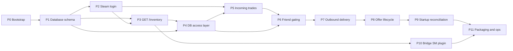

# Steam Giveaway Bot — Phased Development Plan

## Purpose

This document is a **roadmap**: it orders implementation work and defines a testable “done” for each phase. **[steam-giveaway-bot-spec.md](./steam-giveaway-bot-spec.md)** remains the **source of truth** for behavior, data shapes, and edge cases. If this plan ever disagrees with the spec, **follow the spec** and update this plan.

---

## Prerequisites

Before starting, ensure you have:

- **Runtime:** Node.js 20+ and pnpm (or the package manager you commit to the repo).
- **Database:** PostgreSQL reachable from the Steam bot and (for integration tests) from your machine.
- **Steam:** A dedicated bot account; at least one **non-admin** Steam account to act as a giveaway winner; at least one **admin** SteamID64 listed in `BOT_ADMINS` for deposit/withdraw tests.
- **Items:** Tradable TF2 items on the bot inventory for trade and `/inventory` tests.
- **Game server (later phases):** A SourceMod server with `sm-giveaways` and the bridge plugin for P10 end-to-end tests.

---

## Phase dependency overview

**Parallelism:** P10 can begin once **P3** stabilizes the HTTP contract (`GET /inventory` + auth). Full SourceMod integration testing should wait until **P7–P9** implement delivery and reconciliation on the TypeScript side.

---

## Phases

### P0 — Project bootstrap

**Goal:** Establish a runnable TypeScript project with strict config validation and no business logic yet.

**Deliverables:**

- `package.json` with scripts: `start`, `dev`, `typecheck`, `lint` (and `format` if desired).
- `tsconfig.json` aligned with the reference bot (strict mode, ESM if used).
- Environment validation (e.g. Zod + `@t3-oss/env-core`) matching [spec §10](./steam-giveaway-bot-spec.md).
- `.env.example` with every variable name documented; `.gitignore` includes `.env`.
- Minimal `src/index.ts` that loads env, prints a safe banner (no secrets), and exits **or** stays alive with a placeholder—choose one and document it for the next phases.

**How to test / Definition of Done:**

- `pnpm typecheck` and `pnpm lint` pass.
- Running with a valid `.env` completes without logging passwords or secrets.

**Depends on:** none.

---

### P1 — Database schema

**Goal:** Persist `pending_deliveries` as specified.

**Deliverables:**

- Migration(s) or SQL scripts creating `pending_deliveries` per [spec §6](./steam-giveaway-bot-spec.md).
- Document the chosen tool (Prisma, Drizzle, Kysely, raw `pg`, etc.) in the repo README or `docs/`.

**How to test / Definition of Done:**

- Migrations apply cleanly against an empty database.
- Manual `INSERT` and `SELECT` confirm columns, types, and allowed `status` values (`pending`, `offer_sent`, `delivered`, `cancelled`).

**Depends on:** P0.

---

### P2 — Steam login and session

**Goal:** Log the bot into Steam and establish `webSession` cookies for `SteamCommunity` and `TradeOfferManager`, following patterns from the reference `steam-bot` (`SteamUser`, `dataDirectory`, `autoRelogin`, `webSession` handler).

**Deliverables:**

- `src/bot.ts` (or equivalent): client setup, session persistence under `./steam-data` (gitignored), cookie handoff to trade manager.
- Global error / shutdown hooks as needed (see reference `index.ts` + `error-handler`).

**How to test / Definition of Done:**

- Bot logs in successfully; logs show trade manager ready after `webSession`.
- Persona online; optional: `gamesPlayed` for TF2 as in the spec’s operational assumptions.
- Restart reuses session when possible (no unnecessary full relogin loops).

**Depends on:** P0.

---

### P3 — Internal HTTP: `GET /inventory`

**Goal:** Expose the minimal API the bridge plugin needs, bound for local/private use only.

**Deliverables:**

- HTTP server on `API_PORT` (default from spec), binding to loopback or a configurable host suitable for “internal only.”
- Auth: reject requests without valid `X-Bot-Secret` ([spec §5](./steam-giveaway-bot-spec.md)).
- Load TF2 tradable inventory via the same stack as trade offers (`steam-tradeoffer-manager` / `steamcommunity`).
- Exclude any `asset_id` that appears in `pending_deliveries` with status `pending` or `offer_sent` ([spec §5](./steam-giveaway-bot-spec.md)).
- JSON response shape: `assetId`, `name`, `imageUrl` per spec.

**How to test / Definition of Done:**

- `curl` with correct secret returns a JSON array (may be empty).
- Wrong or missing secret returns 401/403 without leaking details.
- With a row in the DB reserving an asset, that asset is absent from the response.

**Depends on:** P1, P2.

---

### P4 — DB access layer

**Goal:** Centralize typed database operations used by HTTP, trades, and reconciliation.

**Deliverables:**

- Functions or repository methods: list pending rows by `winner_steam_id`, fetch all `offer_sent` for startup, update status / `trade_offer_id` / `delivered_at`, etc.

**How to test / Definition of Done:**

- Integration tests **or** a small `scripts/db-smoke.ts` that runs against a throwaway DB and exercises each query path without errors.

**Depends on:** P1, P3 (P3 already reads DB for filtering; layer should formalize this).

---

### P5 — Incoming trade policy

**Goal:** Implement [spec §8](./steam-giveaway-bot-spec.md) for **incoming** offers: admins auto-accepted; everyone else auto-declined. Use mobile confirmations when the bot gives items (`identitySecret`), mirroring the reference `trades.ts` patterns.

**Deliverables:**

- Handler for `newOffer` (and optionally polling of active received offers on login).
- Config: parse `BOT_ADMINS` from env.

**How to test / Definition of Done:**

- From an **admin** account: incoming offer is accepted (and confirmed if required).
- From a **non-admin** account: incoming offer is declined; logs state the reason.

**Depends on:** P2, P4.

---

### P6 — Friend gating

**Goal:** Only accept friend requests from Steam users who have at least one `pending` delivery row ([spec §7](./steam-giveaway-bot-spec.md)).

**Deliverables:**

- `friendRelationship` (or equivalent) handler querying the DB by SteamID64.
- Reject or remove non-matching friend requests per your chosen UX (spec: decline friend request if no pending).

**How to test / Definition of Done:**

- Insert a `pending` row for a test SteamID64; send friend request from that account → **accepted**.
- Remove rows or use another account → friend request **not** accepted (removed/ignored per implementation).

**Depends on:** P4, P5 (order with P5 is flexible; both need Steam + DB).

---

### P7 — Outbound prize delivery

**Goal:** When a pending winner becomes a friend, send **one** trade offer containing **all** pending items for that user; persist `trade_offer_id` and `offer_sent` ([spec §7](./steam-giveaway-bot-spec.md)).

**Deliverables:**

- Compose offer from DB `asset_id`s; validate items still in inventory before sending.
- Update row(s) after Steam returns an offer id.

**How to test / Definition of Done:**

- Manual: winner account receives the correct items in a single offer; DB reflects `offer_sent` and stored `trade_offer_id`.

**Depends on:** P6.

---

### P8 — Offer lifecycle and edge cases

**Goal:** Drive rows through terminal states and handle failures per [spec §11](./steam-giveaway-bot-spec.md).

**Deliverables:**

- Listeners for sent offer state: accepted → `delivered`, `delivered_at`; declined/expired → reset to `pending`.
- Optional: `REMOVE_FRIEND_AFTER_DELIVERY` behavior after success.
- If the player unfriends before completion: cancel offer if possible and reset to `pending` ([spec §11](./steam-giveaway-bot-spec.md)).
- If an item is missing from inventory: log error; **do not** mark delivered ([spec §11](./steam-giveaway-bot-spec.md)).

**How to test / Definition of Done:**

- Manual or scripted checks for: accept path, decline path, unfriend path, multi-row pending merged into one offer.

**Depends on:** P7.

---

### P9 — Startup reconciliation

**Goal:** On boot, reconcile `offer_sent` rows with Steam’s view of each `trade_offer_id` ([spec §9](./steam-giveaway-bot-spec.md)).

**Deliverables:**

- After DB + Steam session ready: query `offer_sent`, fetch each offer state from Steam API, apply same transitions as P8.

**How to test / Definition of Done:**

- With an open sent offer, restart the bot; logs and DB show either resumed monitoring or corrected status (delivered vs reset to pending).

**Depends on:** P8.

---

### P10 — `giveaways_bot.sp` (bridge plugin)

**Goal:** Implement the SourceMod bridge: inventory menu + refired `sm_gstart`, ended forward inserts DB row + chat line ([spec §4](./steam-giveaway-bot-spec.md)).

**Deliverables:**

- `Giveaways_OnGiveawayStart`: block, HTTP `GET /inventory`, menu, `g_bBotInitiated` + `FakeClientCommand` for `sm_gstart <name>|<assetId>`.
- `Giveaways_OnGiveawayEnded`: parse prize, guard invalid `winner`, insert `pending_deliveries`, announce bot profile URL.
- SQL connection via `databases.cfg` entry `giveaways_bot`.
- Ensure prize string length fits `sm-giveaways` buffer (`g_cPrize[128]` in upstream plugin); document any naming limits.

**How to test / Definition of Done:**

- On a test server: run `sm_gstart` flow, end giveaway with a winner; row appears in PostgreSQL; chat announcement fires.

**Depends on:** P3 (HTTP stable). Full E2E ideally after **P7–P9**.

---

### P11 — Packaging and ops

**Goal:** Make the bot deployable with persistent session data and documented env.

**Deliverables:**

- `Dockerfile` (multi-stage optional), `.dockerignore`, persistent volume for `steam-data` documented.
- `railway.json` or equivalent if targeting Railway; production env checklist (all spec §10 variables).
- README: how to run locally, migrate DB, and run smoke tests.

**How to test / Definition of Done:**

- Deploy to a staging environment; smoke: Steam login, `GET /inventory` with secret, one controlled trade path (incoming admin or outgoing test).

**Depends on:** P9 (and P10 for full stack confidence).

---

## Out of scope (do not expand phases to cover)

As in [spec §12](./steam-giveaway-bot-spec.md):

- Web dashboard or admin UI
- Multi-server coordination
- Automatic/scheduled giveaways
- Multiple winners per giveaway

`sm-giveaways` already enforces a single concurrent giveaway; the bot does not need extra locking for multiple giveaways on one server.

---

## Revision history

Update this section when phases change materially.

- Initial version: phased roadmap aligned with steam-giveaway-bot-spec.md.
